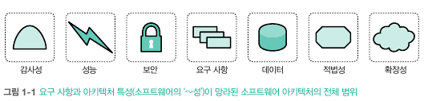
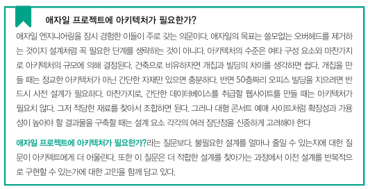
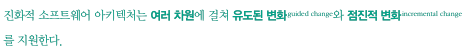
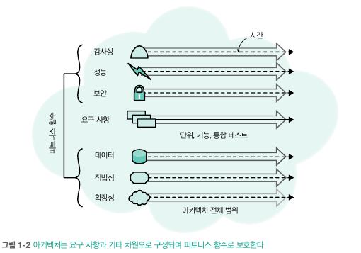

### 진화적 아키텍처는 역학과 구조라는 광범위한 두 연구 영역으로 구성
  - 진화적 아키텍처 역학 (1부 내용)
    - 아키텍처를 진화시키는 엔지니어링 관행과 검증이 중요 요소
    - 엔지니어링 관행, 테스트 메트릭 등 소프트웨어를 진화시키는 다양한 기술 포함
  - 진화적 아키텍처 구축하려면 (2부 내용)
    - 소프트웨어 시스템의 구조나 토폴로지도 중요하게 고려
    - 진화에 용이한 시스템을 구축하는 아키텍처는? 진화를 촉진하기 위해 지양해야 할 구조적 선택은 존재하는가?
  - 진화적 아키텍처의 다양한 사례를 연구 및 조언 제시(3부 내용)
    - 대부분 역학적, 구조적 요소가 함께 얽혀 있음
    - 패턴과 아티패턴을 함께 설명하고, 진화를 가능하게 하는 아키텍트와 팀의 역할 및 과제를 고민

# 진화적 소프트웨어 아키텍처
- 진화 가능한 소프트웨어를 구축하는 두가지 근본 원리를 설명
  - 애자일 소프트웨어 운동에서 확립된 효과적인 엔지니어링 관행
  - 변화와 거버넌스를 촉진하는 아키텍처 구조

## 1.1 진화적 소프트웨어의 과제
- 시간이 지나도 높은 품질을 유지하는 소프트웨어를 구축하기 위해 노력
- 소프트웨어 품질을 유지하기 어려운 이유는 두 가지
  - 복잡한 소프트웨어의 다양한 작동부를 전체적으로 관리하기 어려움
    - 현대 소프트웨어는 수천 또는 수백만 개의 독자적인 부품으로 구성됨
    - 부품 교체 시, 변경 사항의 파급효과는 가끔 예상할 수 있는 범위를 크게 벗어남
    - 거버넌스를 수작업에 의존하면 부수 효과에 압도당할 수 밖에 없음 
  - 개발 생태계는 항상 역동적으로 변화
    - 수많은 도구, 프레임워 크, 라이브러리, 모범 사례로 구성되며 특정 시점의 최신 기술이 축적
    - 소프트웨어 생태계는 개발자가 이해하고 만들수 있는 것들로 균형일 이룸, But 균형이 동적(Dynamic)임
- 소프트웨어 아키텍트는 끊임 없이 변화하는 환경에 적응하며 균형을 유지
  - 지속적 전달(CD)라는 엔지니어링 기법은 아키텍트 세계의 균형을 뒤흔든 지각 변동과 같음
  - 운영등의 고립된 환경과 소프트웨어 개발을 통합하므로써, 5년 단위의 정적인 계획에 의존할 수가 없게 됨 -> 시간이 지나면 진화하게 됨으로 인해
- 파괴적 변화의 조짐은 실무자도 예견하기 어렵지만, 일련의 소소하고 점진적인 사건을 통해 알 수 있음
  - 혁신이 이루어지는 과정은 이보다 훨씬 더 유기적임
  - 새로운 기술은 끊임없이 생태계 안에서 등장하며, 다른 신기능과 기존 기능을 결합하는 통로를 염
- '특정 문제를 해결하기 위한 구조 설계'는 아키텍트의 주요 업무 중 하나
  - 구조 설계 시작할 때, '도메인(요구사항)'과 '아키텍처 특성' 두영역을 나뉘어 생각\

    - 도메인(요구사항): 해당 소프트웨어가 해결해야 할 모든 문제 도메인
    - 아키텍처 특성: 도메인을 제외한 모든 것, 다양한게 불림
      - 비 기능적 요구사항, 시스템 품질 속성, 공통 요구 사항 등
  -  정적인 소프트웨어는 거의 없기에, 아키텍트는 아키텍처 특성을 보호할 보호 메커니즘을 마련
- 아키텍처에 관한 의사 결정은 각 선택에 따른 장단점 차이가 큼
  - 아키텍처에 관련된 중대한 결정을 내리기 위해서는 여러 분야가 협력해야함

## 1.2 진화적 아키텍처
- 아키텍처의 진화 메커니즘과 아키텍트가 내리는 모든 결정은 다음 정의로부터 파생\

##### 유도된 변화
- 아키텍처의 핵심 특성을 선정하면 해당 특성을 보호하는 방향으로 유도해야함
  - 피트니스 함수라는 진화적 컴퓨팅 개념을 차용
    - 대상 알고리즘이 시간이 지남에 따라 얼마나 개선되었는지를 측정 -> 변형에 얼마나 적합한지 판단
- 아키텍처의 진화에 따른 변화가 핵심 특성에 영향을 미치는지 평가하고, 시간이 지남에 따라 이러한 특성이 저하되지 않도록 방지할 매커니즘 필요
  - 피트니스 함수 활용(2장에서 상세히)

##### 점진적 변화
- 소프트웨어 아키텍처의 두 측면, 점진적 빌드와 배포 방법을 나타냄
  - 소규모의 점진적 변화를 허용하는 아키텍처가 진화에 유리
  - 배포 관점에서 점진적 변화는 비즈니스 기능의 모듈화 및 분리수준과 아키텍처 매핑방식과 관련된 사안
- 기존 서비스는 자신을 필요로 하는 다른 서비스가 존재하는 한 신규 서비스와 함께 실행 -> 이후 더이상 사용되지 않게 됨

##### 다중 아키텍처 차원

- 고립된 것처럼 보였던 현상들이 실제로는 상대적인 상호 작용이라는 사실
  - 지속적 전달은 위와 같은 시각을 운영의 영역까지 미치도록 확장한 기술
- 진화 가능한 아키텍처를 설계하려면 변화의 영향이 미치는 시스템 요소의 모든 상호 연결 관계를 고려
- 또한 아키텍트의 사고는 기술적인 영역 너머의 지점에 닿을 수 있어야함
- 이러한 사안들은 모두 아키텍처를 이루는 차원의 일종\
\

- 아키텍트는 모든 차원에 걸쳐 시스템이 전체적으로 진화할 수 있는 방법을 최우선으로 고려
  - 프로젝트 아키텍처의 전체 범위: 소프트웨어 요구사항 + 나머지 차원
  - 아키텍처 특성을 보호하기 위해 피트니스 함수를 활용\

- 진화적 아키텍처의 상당부분이 기술적 아키텍처 패턴을 바탕으로 만들어지는 커플링, 응집력 등의 주제와 관련이 깊음
- 진화적 아키텍처는 아키텍트의 고민거리를 덜어줌
  - 현대의 소프트웨어 개발 생태계에 몸을 담고 있으면 아래와 같은 궁금증을 가질 수 있음
    - **매 순간 모든 것이 변하는 세계에서 장기적인 계획을 세울 수 있는가?**
    - **아키텍처를 구축한 뒤 시간의 흐름에 따른 질적 저하를 막으려면 어떻게 해야하는가?**

## 1.3 상시 변화하는 환경의 장기 계획 수립 가능성
- 기술 환경의 변화를 기정사실화 하고 시스템을 설계해야함
  - 프로그래밍 플랫폼, 언어, 운영 환경 등 여러 측면에서 지속적으로 변화할 것으로 예상
- 시스템 일부가 다른 부분보다 유독 수정하기 어렵다는 사실 -> 현재 아키텍처를 설계할 때 맹점으로 작용됨
  - 과거와 다르게 소프트웨어 변경 비용이 프로세스 자동화와 데브옵스 기술로 낮춰짐
- 일부 혁신적인 아키텍트들은 '나중에 변경하기 어려운' 문제를 재고하기 시작
  - 아키텍처에 변경 가능성을 탑재 할수 있을까?
  - 손쉬운 변경이 아키텍처의 기본원칙으로 변경
- 변화가 차지되면 점진적 저하 대처는? 그리고 아키텍트가 정의했던 핵심부 보호하는 방법은?(다음절...)

## 1.4 시간에 따른 아키텍처의 성능 저하 방지
- 아키텍트는 비즈니스 요구 사항과 아키텍처 특성에 맞는 패턴을 선택하지만 추 후 의도치 않게 저하되는 경우가 많음
- 한번 정의한 아키텍처의 핵심 특성이 추후 저하되지 않보록 보호하려면?(나중 설명...)
  - 진화성: 시스템이 진화하며 나머지 특성을 보호 한다는 의미

## 1.5 왜 진화인가?
- 점진적, 지속적, 애자일등도 많은데, 왜 진화적 아키텍처라고 부르는 이유는? 유도된 아키텍처는 우리가 달성해야 할 최종목표를 나타내는 정의
  - 지속적, 애자일 등은 모두 시간에 따른 변화의 개념을 내포 -> 최종 상태 및 목표를 제시하지 않음
- 적응 보다 진화라는 단어를 선호하는 이유는? 변화에 순응하는 아키텍처
  - 적응: 솔루현의 우아함이나 수명과 관계 없이 그저 무언가 작동시키는 방법을 찾아냄
  - 진화: 목적에 부합하고 끊임 없이 변화하는 환경에서 살아남음
- 애자일 아키텍처의 목표는 아키텍처의 부재가 아닌 개발과정에 존재하는 무가치한 관련적 행태를 배제하는 것
- 소프트웨어 아키텍처가 복잡해지는 이유는 반드시 설계해야할 복잡성의 유형이 다양
  - 설계 트레이드 오프를 저울질 할때, 단순함과 복잡한을 가르기 보다 복잡한 시스템을 다양한 방식으로 구분하는 경우가 많음
  - 성공적인 시스템을 판가름 하는 기준은 시스템마다 고유하게 존재
- 아키텍트는 다양한 이키텍처 스타일을 통해 대부분 문제 해결 -> 특정 문제에 대해 더 잘 어울리고 부작용이 없는 해결책 존재

## 진화적 아키텍처 핵심
- 장기적인 목표를 뒷바침할 만한 구조와 거버는스를 확보
- 이들을 불필요한 형식과 저항을 낳지 않을 정도로 제한하는 것
- 이 두 조건 사이에 균형을 유지하는 것