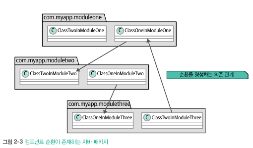
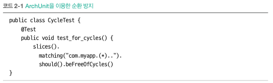
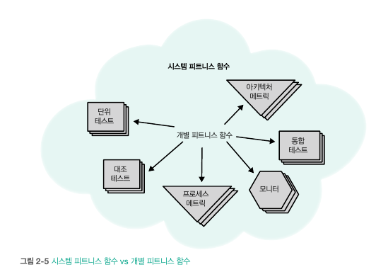

# 2. 피트니스 함수
- 진화적 시스템을 구축하는 기법과 도구는 진화적 아키텍쳐 역학에서 다룸
- 피트니스 함수는 중요한 보호 매커니즘(예를 들면 애플리케이션 도메인의 단위테스트와 유사)\

- 유도: 아키텍처가 지향하거나 표명해야 할 일정한 목표가 존재함을 나타냄
- 피트니스 함수를 통해 진화하는 컴퓨팅 내 결정을 유도

## 2.1 정의

- 솔루션의 도메인 특성 보존을 위해 다양한 방법으로 유지함
  - 단위, 기능, 사용자 테스트 진행
  - 전담 QA 조직을 두어 도메인 특성 보존
  - 문제 도메인의 진화적 변화 관리를 위해 테스트 라이브러리 활용
- 피트니스 함수의 대상은 아키텍처 특성(단위 테스트의 대상이 도메인인 것처럼)
  - 아키텍처 특성이 다양한 것처럼 단일 도구로 검증 불가
  - 피트니스 함수는 자신의 생태계 여러 부분에 다양한 도구를 접목\

    - 모니터: 데브옵스 및 운영 도구이며, 성능 및 확장성 등을 확인하는 도구
    - 코드 메트릭: 아키텍트는 단위 테스트에 메트릭을 비롯한 여러 검증 절차를 추가 가능(4장 상세히)
    - 카오스 엔지니어링: 원격 환경에 인위적 결함을 주입하고 스트레스 가함 -> 시스템의 복원력 구축 목적
    - 아키텍처 테스트 프레임워크: 다양한 검증 절차를 자동화된 테스트 형태로 아키텍트가 직접 가공
    - 보안 스캐닝: 관활 부서 있어도 아키텍트의 설계와 선택에 영향을 미치기에 필수

#### 피트니스 함수 예시 (컴포넌트 순환)

- 일반적으로 아키텍트는 순환 참조가 발생하지 않기를 원하지만 각종 편리한 도구들은 적극적으로 대항
  - IDE가 참조 선언을 하라는 어포던스를 해줌에 아무런 주의를 기울이지 않고 반사적으로 반응\

- 이러한 순환 참조를 발생하지 않기 위해 ArchUnit 이라는 도구를 활용\

#### 다시 정의 파트로
- 함수라고 해서 단순 코드만을 뜻하는 건 아님 -> 입력 값을 넣으면 허용된 출력을 하는 것을 뜻함
- 아키텍처의 요구 사항마다 피트니스 함수가 필요하며, 각각의 관리 요소를 측정하는 방법을 찾아야하며 때로는 직접 고안 필요
- 진화적 아키텍처가 피트니스 함수에 의해 유도 된다 -> 아키텍처의 선택 사항 각각을 피트니스 함수를 통해 평가한다는 뜻
  - 이러한 평가는 변화의 영향력을 반영
- 피트니스 함수는 해당 아키텍처에서 중요한 것이 무엇인가에 대한 총제적 정의
- 피트니스 함수는 검증 메커니즘을 단일 메커니즘으로 통합
  - 이전에는 코드 품질, 데브옵스 메트릭, 보안 등의 다양한 아키텍처 검증 메커니즘을 별개로 취급
  - 중요한 아키텍처 임곗값과 요구 사항을 한데 모으면, 이전 모호하고 주관적이었던 평가 기준을 더욱 구체적으로 표현 가능
- 모든 테스트가 피트니스 함수로 쓰이지는 않지만 아키텍처의 무결성을 검증하는 데 도움이 되면 피트니스 함수로 간주 가능

## 2.2 범주
- 피트니스 함수는 스코프, 케이던스, 결과, 호출, 능동성, 커버리지 등의 다양한 범주에 걸쳐 존재

#### 2.2.1 스코프: 원자 vs 전체
- 원자 피트니스 함수: 단일 콘텍스트로 실행되며 아키텍처의 특정 측면을 검사
  - 모듈러 커플링 검증, 순환 의존성 검증 등
- 전체 피트니스 함수: 공유 콘텍스트에서 실행되며 여러 아키텍처 측면을 조합해 검사
  - 애플리케이션이 동작하는 중 아키텍처 특성 중 확장성과 보안을 피트니스 함수를 통해 확인 
- 아키텍처는 모든 조합을 일일이 테스트하는 것이 불가능하기에, 중요한 상호작용을 선별하고 조합해 전체 피트니스 함수를 적용해야함

#### 2.2.2 케이던스: 트리거 vs 지속 vs 시간
- 트리거 피트니스 함수: 특정 이벤트를 기반으로 실행되는 피트니스 함수
  - 배포 파이프라인이 실핸한 단위 테스트, QA 담당자가 수행하는 탐색 테스트 등
- 지속 피트니스 함수: 정해진 실행 일정 없이, 아키텍처 요소를 지속적으로 검사
  - 모니터링 도구를 활용하여 객관적인 측정 범위를 벗어나는 편차를 감지하고 경보를 설정
- 시간 피트니스 함수: 적합성 평가에 시간적 요소를 추가하는 경우 활용
  - 암호화 라이브러리를 사용하면 일정 시간 이후, 중요한 업데이트가 수행되었는지 확인

#### 2.2.3 사례연구: 트리거 vs 지속
- 지속 피트니스 함수
  - 장점: 실시간 모니터링을 통해 규정을 위반한 부분을 감지 가능 -> 즉시성
  - 단점: 런타임 오버헤드 발생, 모니터링 유지에 대한 리소스 필요, 성능 관찰을 위한 성능과 확장성 부정적 영향
- 트리거 피트니스 함수
  - 장점: 런타임에 영향을 미치지 않음 -> 발동할때만 실행되고 로그 레코드를 통해 확인
  - 단점: 보안 등의 중대한 거버넌스 문제에 대한 대응시간이 늦어질 수도 있음 -> 즉시성이 떨어짐
- 서로 트레이드오프에 따른 경우가 다르기에 상황에 맞춰 잘 고려하여 선택하여야 함

#### 2.2.4 결과: 정적 vs 동적
- 정적 피트니스 함수: 고정적인 결과 값 산출
  - 바이너리, 숫자 범위 등 기댓 값이 이미 정의되어 있는 피트니스 함수
  - 메트릭은 피트니스 함수가 자주 활용하는 소재
- 동적 피트니스 함수: 외부 콘텍스트, 실시간 콘텐츠처럼 변화하는 대상을 근거로 정의
  - 동시 사용자 수가 증가하며 응답성이 다소 저하되는 것은 문제가 안됨
  - 장애로 인해 응답성에 저하는 문제가 됨
- 피트니스 함수는 객관적인 결과로 평가되어야 하지만 평가의 근거는 동적 정보를 바탕으로 세워질 수 있음
  - 역동성과 객관성은 상충하는 특성이 아니다 (?)어떤 의도로의 의미지...

#### 2.2.5 호출: 자동 vs 수동 (3장에서 상세히)
- 자동 피트니스 함수: 자동화 콘텍스트에서 실행되는 피트니스 함수
  - 지속적 통합 및 배포 파이브라인 등에서 실행되는 피트니스 함수
- 수동 피트니스 함수: 자동화하기 매우 어려워 불가피하게 수동으로 처리되어야 하는 함수
  - 법적 요건이나 탐색 테스트 등

#### 2.2.6 선제적: 의도 vs 긴급
- 의도 피트니스 함수: 아키텍트가 공식 거버넌스 프로세스의 일부로 시작 단계에서 작성하는 함수
  - 협업 과정에서 작성하는 경우도 존재
- 긴급 피트니스 함수: 실시간 운영 중 발생하는 거버넌스를 개선할 만한 부분에 대한 피트니스 함수
- 특정 부분을 보호하기 위해 만든 피트니스 함수가 추후 다른 피트니스 함수로 발전되는 경우도 존재
- 아키텍트 요구사항이 변경되고 발전함에 따라 피트니스 함수도 적절히 변경되어야 함

#### 2.2.7 커버리지: 도메인별 피트니스 함수
- 일반적인 피트니스 함수는 문제 도메인이 아닌 추상적인 원칙에 따라 작동
- 테스트 자동화 도구가 동일하다 해도 실제 상황에서 테스트가 두 집합으로 분리
  - 도메인 로직 테스트
  - 피트니스 함수(성능, 확장성) 테스트
- 피트니스 함수는 프로젝트의 검증 메커니즘 중 하나이며, 여타(도메인) 검증과 함께 공존해야함

## 2.3 피트니스 함수는 누가 작성하는가
- 일반적으로 아키텍트는 중요한 아키텍처 틍성의 객관적인 척도를 세우기 위해 피트니스 함수 작성
- 아키텍트와 개발자는 모두 피트니스 함수를 관리하며 항상 유효한 상태를 유지해야함
- 아키텍트는 개발자와 협업하며 피트니스 함수의 목적과 활용 방안을 정의하고 함께 이해해야함

## 2.4 피트니스 함수 테스트 프레임워크 선택
- 문제 도메인을 테스트할 때, 기술 스택과 플랫폼에 맞춰 도구 활용
- 아키텍처 피트니스 함수는 문제 도메인과 같은 턴키 도구가 존재하지 않음
- 여러 도구를 통해 아키텍트가 프로그래밍의 접착제를 약간만 활용하면 맞춤형 피트니스 함수를 구성할 수 있음

## 2.5 결과 vs 구현
- 아키텍트는 상세 구현보다 결과가 더 중요 -> 결과는 아키텍처 특성을 객관적으로 나타내는 특성
- 해당 책에서는 피트니스 함수 구현보다 아키텍트의 측정 기법보다는 측정의 이유와 결과에 더 집중해서 보는 편이 좋음
- 원하는 방향으로 아키텍처가 진화 하도록 피트니스 함수를 통해 유도 하며, 이는 여러 측면에 제약을 두고 잘못된 방향의 진화를 억제
- 시스템 피트니스 함수: 피트니스 함수들을 한데 모은 개념, 각 피트니스 특성간 충돌에 대한 트레이드 오프 관계 확인 가능\

  - 아키텍처 진화에서 결정적인 역할을 함
  - 지시 대상의 성격이 강한 피트니스 함수 <-> 의사 결정의 우선순위를 정하기 위한 지침으로 활용되는 시스템 피트니스 함수
  - 피트니스 함수가 제공하는 객관적인 지표를 통해 시스템 전반의 트레이드 오프를 추론하는 근거로 삼음
  