# 3. 점진적 변화 엔지니어링
- 진화적 아키텍처는 다양한 차원에 점진적 변화를 유도
  - 점진적 변화: 일련의 사소한 변화를 통해 아키텍처 전체의 변화를 달성
- 점진적 변화는 두 가지 측면에서 논의
  - 소프트웨어를 구축하는 개발자 관점
  - 소프트웨어를 배포하는 운영자 관점

## 3.1 점진적 변화
##### 점진적 변화 예시
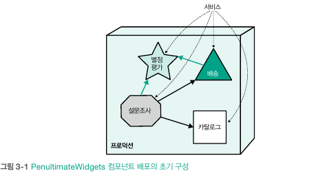\
기존 별점 평가 서비스 활용

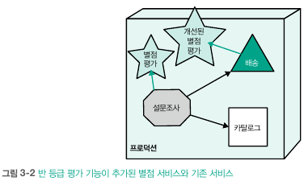\
신규 별점 평가 서비스와 기존 서비스 혼용

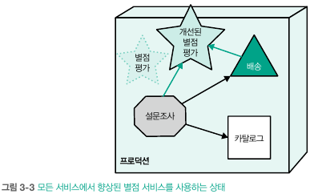\
일정 시간 이후 전체 서비스가 신규 서비스로 전환되었으면 기존 서비스 제거

- 개발팀이 신규 서비스를 배포할 때, 기존 서비스를 호출하는 다른 서비스까지 강제로 업그레이드할 필요는 없어야 함
  - 기존 서비스와 신규 서비스는 연속되며, 추후 기존 서비스가 사용되지 않을 때 제거
- 아키텍처의 모든 변경 사항은 배포 파이프 라인 관리 하에 반영
  - 아키텍트는 배포 파이프라인을 통해 어떤 피트니스 함수를 언제 얼마나 자주 실행할지 정의할 수 있음

#### 3.1.1 배포 파이프라인
- 배포 파이프라인 메커니즘은 지속적 전달(CD) 기술에 속함
- 배포 파이프라인은 피트니스 함수를 실행할 이상적인 장소를 제공\
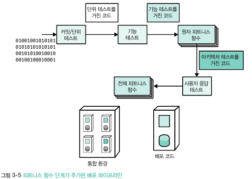
  - 서비스가 변경할 때마다 수많은 테스트가 실행되며, 코드의 정확성과 아키텍처 전반의 피트니스를 검증
- 여러 작업을 병렬로 실행하는 팬아웃은 배포 파이프라인을 조율할 때 적용되는 개념
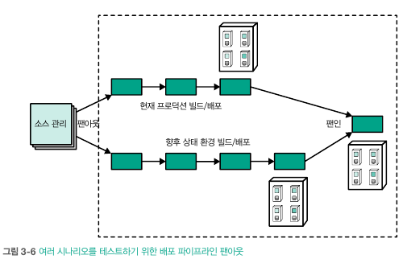
  - 변경 사항이 현재 프로덕션에 부정적인 영향 유무 확인
  - 변경 사항이 잘 반영되어 미래 상태 환경에 문제가 없는지 확인
  - 완료 되면 펜인을 수행
- 지속적 배포가 비즈니스에 미치는 영향도 간과하면 안됨
  - 사용자 측면에서 빅뱅 방식의 배포 선호 -> 임팩트가 더 크기에...
  - 기능 토글을 활용하여 신기능 운영 시점과 소비자 릴리스 시점 분리
- 배포 파이프라인 내부에 피트니스 함수가 추가되면 아키텍트와 개발자는 진화 가이드 라인을 위반하지 않을 것이라는 높은 수준의 확신을 갖게됨

#### 3.1.2 사례 연구 1: penultimateWidgets의 피트니스 함수
- 아래와 같은 요구사항 존재\
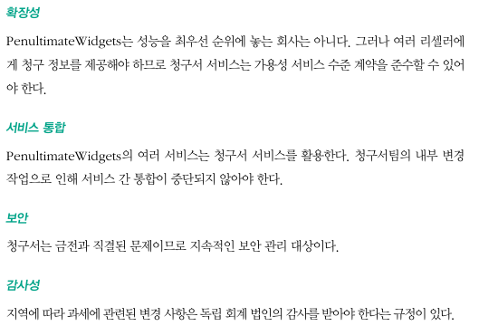
- 진화적 아키텍처 피트니스 함수 구현\
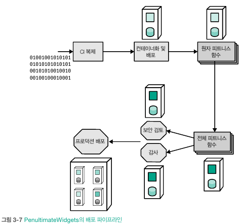\
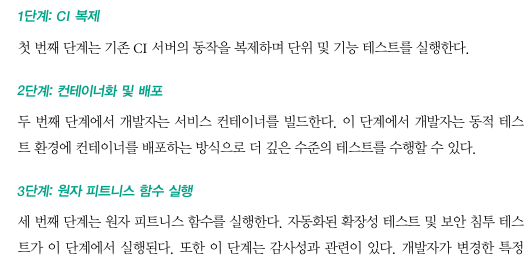\
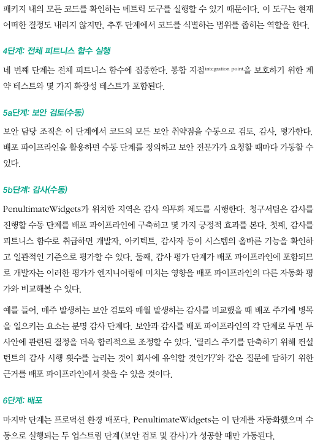

#### 3.1.3 사례 연구 2: 자동화 빌드의 API 일관성 검증
- 복잡한 체계 시스템 내부를 깔끔한 인터페이스로 캡슐화한 API 설계
- 많은 통합 사용자를 보유하고 있으므로 변경 사항을 배포할 때는 이전 버전과 충돌하거나 장애가 발생하지 않도록 주의
- 아래와 같이 아키텍트는 배포 파이프라인 설계

##### 배포 파이프라인
- openapi.yaml에 게시된 신규 API의 설계 및 정의 시 시작 (검증 체인 1단계)
  - 신규 스펙구조와 기타 요소를 검증\
  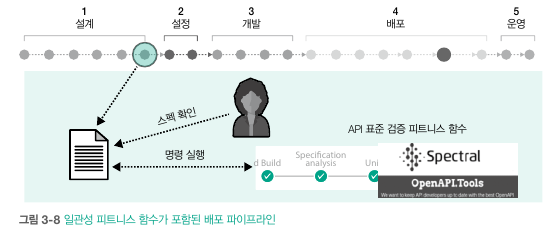

- 개발이 시작 될 때 등장 (검증 체인 2단계)
  - 샌드박스 환경에 게시해 테스트 진행 (이전과 동일하게 작동되는지 확인)\
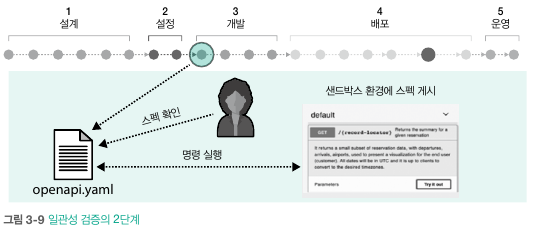
  
- 통합 아키텍처 영역을 테스트 (검증 체인 3단계)
    - 서비스 간 통합 테스트를 수행하며 통합 지점을 보존\
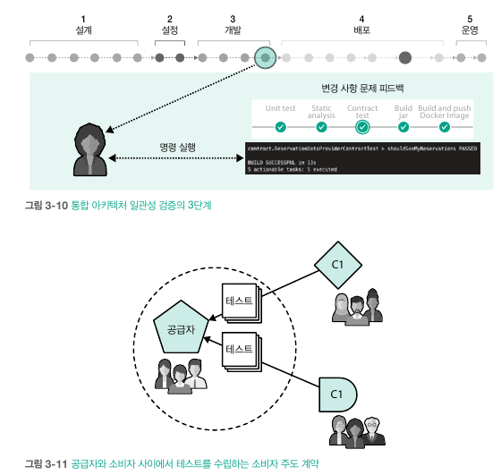

- 진화적 아키텍처의 점진적 변화에 내포된 암묵적인 전제 중 하나는 개발팀의 엔지니어링 성숙도
  - 위와 같은 작업이 되려면 개발자의 능력이 일정한 성숙도에 도달해야 함
