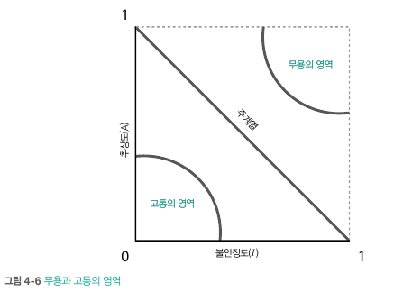

# 4. 아키텍처 거버넌스 자동화
- 진화적 아키텍처는 다양한 차원에 점진적 변화를 유도
  - 점진적 변화: 일련의 사소한 변화를 통해 아키텍처 전체의 변화를 달성
- 점진적 변화는 두 가지 측면에서 논의
  - 소프트웨어를 구축하는 개발자 관점
  - 소프트웨어를 배포하는 운영자 관점

## 4.1 피트니스 함수와 아키텍처 거버넌스
- 진화적 아키텍처 메커니즘은 아키텍처 거버넌스, 거버넌스 자동화와 많이 겹침
- 소프트웨어 엔지니어링을 발전 시킨 원동력 중 한가지는 지속적 통합
  - 점진적 변화와 자동화의 위력을 표상
- 자동화는 지속적 통합에서의 반복적인 부분을 해소
- 지속적 통합은 점진적 변화를 이끌어 냄
  - 점진적 변화가 피트니스 함수와 결합하면 다양한 방면에서 엔지니어링 관행의 진화가 일어남
- 피트니스 함수는 저수준 코드 기반 분석에서 엔터프라이즈 아키텍처에 이르기까지 모든 아키텍처 측변에 존재\

## 4.2 코드 기반 피트니스 함수
- 아키텍트가 코드 수준 메트릭을 기반으로 무난하게 활용할 도구 존재
##### 4.2.1 구심 및 원심 커플링
- 구심 및 원심 커플링
  - 구심 커플링: 수신 연결 수
  - 원심 커플링: 발신 연결 수
- 아키텍처의 커플링은 특성에 영향을 미치고 제약을 걸기에 중요 관심사
- 거버넌스 통제 없으면 아래와 같은 일 발생\

- 커플링 관계 출력하는 도구
  - JDepend, intellij, 소나 큐브 둥

##### 4.2.2 추상도, 불안정도, 메인 시퀀스와의 거리
- 추상도: 구상 아티팩트(구현 클래스)에 대한 추상 아티팩트(추상 클래스,인터페이스) 비율
  - 코드베이스의 전체 구조를 더 잘 이해하도록 도움
  - mc는 구상요소, ma는 추상요소\

- 불안정도: 원심과 구심 커플링의 합에 대한 원심 커플링의 비율
  - cc는 원심(발신), ca는 구심(수신)\

- 주계열과의 거리: 아키텍트가 아키텍처 구조에서 도출할 수 있는 메트릭
  - A는 추상도 I 불안정도\

  - 해당 메트릭을 통해 구조 파악 가능 -> 선에 가까울수록 좋음\

- 위와 같은 메트릭은 리팩토링에 활용되기도 함

##### 4.2.3 임포트 방향성
- 컴포넌트 순환을 방지하려면 임포트 방향성을 관리해야함
  - JDepend 도구 활용 가능
- 위와 같은 도구를 활용하여 임포트 방향성 관리 가능

##### 4.2.4 순환 복잡도와 군집 거버넌스
- 순환복잡도: 함수 또는 메서브 복잡도를 측정하는 수단
  - 업계에서 일반적으로 10 이하 값을 선호, But 알고리즘 복잡도 고려 필요\ 

- 이러한 기법들을 통해 피트니스 함수를 만들고 거버넌스를 통해 비트 부패 방지 가능
## 4.3 턴키 도구
- 모든 아키텍처는 서로 다르기에, 아키텍트가 마주하는 복잡한 문제에 대응하는 기성 도구 찾기 힘듬
  - 아키텍처가 놓인 생태계의 보편성이 높을수록 일반화 도구 찾을 가능성도 높음

##### 4.3.1 오픈 소스 라이브러리의 적합성
- 일부 자유주의 라이센스는 해당 소스를 사용한 프로젝트도 같은 라이센스를 채택하도록 요구
- 해당 라이센스 적합성에 대한 도구 활용
  - Black Duck
- 만약 없다면 피트니스 함수를 직접 구축\

##### 4.3.2 접근성 및 기타 아키텍처 특성
- 무엇을 검색해야할지 아는 것만으로 올바른 도구를 찾을 수 있는 경우 존재
  - A11y -> 접근성
- 많은 기업과 정부 기관이 접근성을 요구 조건으로 내세우기 시작하면서 접근성 검증 도구도 부흥기 맞음
  - Pa11y
##### 4.3.3 ArchUnit
- 코드 구조가 아닌 아키텍처 기능을 테스트하도록 설계됨
  - 패키지 종속성
  - 클래스 의존성 검사
  - 상속 검사
  - 애너테이션 검사
  - 계층 검사
- 아키텍트가 위키 등의 정보 공유 수단을 통해 원식을 기록하지만 제대로 읽는 사람은 거의 없음
- 실행이 뒤따르지 않는 원칙은 의미가 없음 -> 위와 같은 피트니스 함수를 통해 적용하자
##### 4.3.4 코드 거버넌스와 린터
- 대부분의 프로그래밍 언어는 코드의 안티패턴이나 결함을 찾는 스캔 도구인 린트를 포함
- 아키텍트가 수립한 거버넌스 규칙에 맞게 정책 적용 가능
##### 4.3.5 가용성 피트니스 함수 
- 기존 레거시 시스템에 피트니스 함수를 적용하여 트래픽 감당이 가능한지 확인\

##### 4.3.6 카나리아 릴리스와 부하 테스트
- 단일 인스턴스가 처리량이 높아질 때마다 부하를 따라잡기 애씀 -> 임시 방편으로 자동 스케일링 구현
- 피트니스 함수를 통해 잠재적인 전체 영향도를 테스트 함 -> 임시 방편이 얼마나 더 오래 지속될지 쉽게 파악 가능\

##### 4.3.7 이식원칙
- 피트니스 함수를 적용하여, 해당 기능이 꼭 필요한지 판별하여 이식 판단이 가능
  - 피트니스 함수를 통해 해당 기능에 대한 사용자 접근 및 활용성 확인 가능

##### 4.3.8 이미 사용 중인 피트니스 함수
- 설명되는 도구들과 기법들은 이미 존재하는게 많은
- 피트니스 함수 개념이 주는 통찰은 다양한 도구를 하나의 관점을 통합하는 사고 방식을 이끔
- 단순 측정이 곧바로 피트니스 함수가 되는것이 아닌, 객관적인 척도에 경고와 알림이 접목되어야 함
## 4.4 통합 아키텍처
- 피트니스 함수는 개별 앱에 적용하는 경우도 많지만 아키텍처 생태계 거버넌스가 필요한 부분에 적용 가능
- 통합 아키텍처 본질은 일반화라는 원칙에 대항행 서로 다른 특수한 부분들을 통합하는 것

##### 4.4.1 마이크로서비스의 통신 거버넌스
- 마이크로서비스와 같은 분산 아키텍처에서는 이전에 봤던 순환구조와 테스트 방식 적용이 쉽지 않음 -> 아키텍처 이질성에 가로 막힘
- 마이크로 서비스를 다루려면 하나의 도구만으로는 역부족
- 아키텍트가 피트니스 함수를 직접 작성 or 도구 및 '접작체' 코드 활용
  - 아래와 같은 MSA 환경 존재\
  
  - MSA 로그 형식에 맞춰 서비스간 통신 확인하는 피트니스 함수 적용\
\

- 트리거와 지속 피트니스 함수의 트레이드 오프 고려 -> 거버넌스의 중점에 따라 다름
##### 4.4.2 피트니스 함수 구현 방법 선택

## 4.5 데브옵스
- 거버넌스의 관심사는 생태계를 구성하는 모든 요소와 점점을 생성
- 데스옵스와 관련된 피트니스도 삼수도 그중 일부
- 접점이 단순 운영 분야의 관심사가 아니라 피트니스 함수여야 하는 이유
  - 피트니스 함수는 소프트웨어 아키텍처와 운영의 교차 지점에 있음
  - 피트니스 함수는 객관적인 거버넌스 점검 결과를 드러냄
  
## 4.6 엔터프라이즈 아키텍처
- 엔터프라이즈 아키텍트가 생태계에 큰 영향을 미치는 순간은 비즈니스 기능을 캡슐화 시킬 플랫폼을 정의할 때
- 이러한 구현 세부 사항을 가능한 작은 범위로 한정 지어야한다는 대의와 지향점이 일치
  - 세부 정보를 이용해 서비스에 접근하면 취약점을 노출\

  - 비즈니스 기능을 캡슐화 시키고 계약을 통해 관리하는 플랫폼을 설계\

- 엔터프라이즈 아키텍트가 피트니스 함수를 구축하는 데 집중하면 저략적 비전을 관리할 수 있음
- 플랫폼 사이의 느슨한 커플링을 보장하는 퀀텀 경계와 계약을 수립하고, 궁극적으로 재사용 가능한 생태계를 구축해야함

##### 4.6.1 정확성 피트니스 함수
- 정확성 피트니스 함수라는 검증 유형
  - 시스템을 교체하는 동안 시스템의 정확성을 보존하는 수단
- 정확성 피트니스 함수를 이용하면 구형과 신형 시스템을 나란히 비교 가능

## 4.7 피트니스 함수는 무기가 체크리스트다
- 피트니스 함수는 아키텍처 원칙을 시행할 방법을 제시 -> 체크리스트
- 지식 공유 포털에 아키텍처와 설계 원칙을 문서화 명시해도 지켜지지 않으면 유명 무실
  - 피트니스 함수를 활용하여 지키자
- 피트니스 함수 작성 시, 항상 개발자와 협력하자
## 4.8 피트니스 함수 문서화
- 피트니스 함수를 문서화 해도 읽기 어려울 수 있음 -> 가독성 좋게 테스트화 도구 활용\

- 피트니스 함수를 문서화 하는 것은 개발자에게도 중요
  - 피트니스 함수 존재 이유를 납득하지 못하면 힘들어짐
- 가급적 조직 내 기존 문서 프레임워크에 피트니스 함수 정의를 통합할 것을 권장
