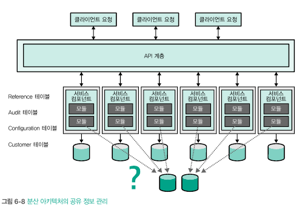

# 6. 진화적 데이터
- 데이터는 아키텍처 커플링보다 더 골치 아픈 결합 구조를 형성
- 데이터는 진화적 아키텍처 설계에서 매우 중요하게 다루는 차원
  - 특히 MSA에서 파티셔닝, 의존성, 트랜잭션성 등 더욱 심도 깊게 고려 필요

## 6.1 진화적 데이터베이스 설계
- 요구 사항의 변화에 따라 발전하는 데이터베이스를 구축하는 것
- 데이터베이스 설계는 실제 세계를 추상화 시킨 것 -> 실제 세계에서 발생하는 변화도 추상화 되어야 함

#### 6.1.1 진화적 스키마
- 진화적 데이터베이스 설계의 핵심은 진화하는 스키마이며, 이는 코드를 통해 실현 가능
- 개발자는 데이터베이스 변경 사항을 마치 소스 코드처럼 관리해야함
  - 테스트: 데이터베이스 스키마의 변경 사항을 엄격하게 테스트 -> 피트니스 함수를 통해 매핑 코드와 스키마를 항상 동기화
  - 버전관리: 스키마와 관련 코드에 버전을 지정
  - 증분 변경: 데이터베이스 스키마의 변경 사항도 증분 방식으로 기록
- 데이터베이스 마이그레이션 도구는 배포라인을 통해 증분 변경 작업을 자동으로 수행해주는 유틸리티
  - 한번 마이그레이션은 되돌릴 수 없다고 간주\

    - 만약 위와 같이 dateofbirth를 지우고 싶다면? -> 코드와의 부수효과 억제를 위해 새로운 마이그레이션 추가하여 제거
    
#### 6.1.2 공유 데이터베이스 통합
- 공유 데이터베이스 통합 패턴은 데이터베이스를 공유메커니즘으로 사용하는 통합 패턴\

- 데이터베이스를 통합 지점으로 활용하면 이를 공유하는 모든 프로젝트는에서 스키마가 고착화될 우려가 있음
  - 기능 개선을 위해 스키마를 변경하면 다른 애플리케이션은 잠재적 장애 위험이 처할 수 있음
- 커플링 해소하는 일반적인 리팩터링 패턴은 '확장/수축 패턴' 임\

  - 시작 상태와 종료 상태 사이에 이전 상태와 변경 상태가 동시에 존재
  - 전환 기간 동안 이전 버전과의 호환성을 보장하며, 변경사항을 수용하기까지 충분한 시간 여유가 생김\

## 6.2 부적절한 데이터 얽힘
- 데이터베이스 또는 데이터팀은 통상적인 수준보다 뒤처진 개발 도구와 엔지니어링 관행을 따르는 경우가 많음 -> 벤더사에 따른 관성
- 데이터 구조는 애플리케이션 코드와 커플링을 이루는 경우가 많음 -> 섣불리 리팩토링하기 힘듬
- 오픈 소스와 NoSQL가 저변을 넓히며 데이터베이스 벤더의 헤게모니는 점차 무너지고 있음

#### 6.2.1 2단계 커밋 트랜잭션
- 대부분의 프로젝트는 아키텍처 기술 외에도 트랜잭션을 비롯한 다양한 커플링 구조를 포함
  - 모놀리식 또는 분산 아키텍처 포함
- 비즈니스 시스템에서 트랜잭션을 사용하는 이유는 다양
  - 비즈니스 분석가들의 사랑을 받음 -> 일시적으로 세상을 멈추는 능력(isolation)
  - 트랜잭션의 경계를 조사하면 비즈니스 개념이 실제 구현과 어떻게 결합되어 있는지 확인 가능
  - 트랜잭션 콘텍스트를 데이터팀이 관할하고 있다면 아키텍처의 기술적 커플링과 마찬가지로 데이터의 결합 역시 분리하기 쉽지 않음\
    (?) 이게 사용이유랑 무슨 관련이...
- 아키텍트는 트랜잭션 콘텍스트를 가급적 제한해야함 -> 견고한 커플링을 형성하기 때문
- MSA 구축하는 개발자들은 서비스와 데이터 콘텍스트의 규모를 주의 깊게 제한해야함
  - 서비스의 크기를 줄이는 것보다 유용한 경계 콘텍스트를 포착하는 것이 더 중요
- 개발자가 만드는 서비스의 세분화 정도는 비즈니스를 지원하는 트랜잭션 콘텍스트가 결정

#### 6.2.2 데이터의 연식과 품질
- 데이터 베이스 스키마가 실제 세계를 추상화시킨 존재라는 사실
  - 코드보다는 변경이 드물지만, 분명 변경이 되는 존재
- 새로운 요구사항에 대해 데이터베이스를 리팩토링하지 않고 반영하는 방법은? 조인 테이블 추가
  - 단기적으로 효과를 내지만, 본래 추상화 구조를 난독화시키는 결과를 초래
    - 본래의 추상화: 단 하나의 엔티티로 여러 사물을 표현
  - 오랜 기간 리팩토링하지 않으면 복잡한 그룹화와 다발성 전략에 매몰됨
- 여러 세대의 소프트웨어를 거쳐 살아남은 데이터는 제각기 고유한 퍼시스턴스 문제에 시달림\
  (?) 데이터베이스 마이그레이션 하면서 발생하는 문제를 말하는 걸까?
- 개발자가 먼저 데이터 스키마와 품질을 함께 발전시키는 것이 좋음
  - 열악한 구조는 리팩토링으로 바로 잡고, 구체적인 리팩토링 작업 계획은 데이터의 품질을 기준으로 수립됨
- 레거시 데이터의 영구적 보존과, 혁신적인 변화를 도모하는 역량 사이에서 올바른 방향을 선택해야함

#### 6.2.3 사례연구: 라우팅의 진화
- 새로운 요구사항에 대해 '확장/수준 패턴'을 이용해 새로운 라이팅 구조를 만듬\

  - 한쪽의 변경사항이 다른 쪽 테이블에 자동으로 복제
- 이전 버전이 더 이상 필요하지 않게 되면 구형 테이블과 트리거 제거\

## 6.3 네이티브에서 피트니스 함수로
- MSA 관점에서 도메인 컨텍스트 당 DB를 생성하면 기존 단일 DB만 사용했던 관점과는 달라짐
  - 참조 무결성에 세심한 주의를 기울이게 됨
- 빌드 과정에 피트니스 함수를 적용해 중요 지점에 무결성을 보장
#### 6.3.1 참조 무결성
- 데이터 스키마 수준에서 형성되는 거버넌스의 일종 -> 서로 다른 DB로 나누는걸 꺼리게 만듬
- 기본키와 연결 관계에 근거해 형성
- 아키텍트는 정보 소유자가 특정 항목을 삭제 했을 때, 이를 참조하는 다른 서비스에 삭제 사실을 전파하는 피트니스 함수 작성\
(?) 이게 왜 피트니스지... 그냥 saga의 오케스트레이션 패턴 아닌가? 아키텍처적인 이유로 피트니스 함수로 표현??\

#### 6.3.2 데이터 중복
- 단일 RDB를 사용하면 읽기와 쓰기라는 두 작업이 별개라는 사실을 잊게됨
- 다수의 서비스가 공통 데이터에 접근하려면 어떻게 할까?
  - 모든 서비스가 테이블을 공유하는 방식으로 문제 해결 -> 커플링 발생으로 MSA 원칙 위배\

  - 다른 공유 데이터 접근 방식 -> 서비스 간 통신 폭증 유발\

  - 인프로세스 캐싱 -> 각 서비스가 필요 정보 캐시 되어있다가 새로운 데이터로 갱신되면 소유자가 캐시 데이터 전달\

#### 6.3.3 트리거 및 저장 프로시저 대체
- 저장 프로시저는 SQL로 작성하며 탁월한 데이터 조작 능력과 우수한 성능으로 한 때 각광
  - 단위 테스트 검증 어렵고, 리팩토링 난이도가 높으며, 소스코드의 동작과 분리되어 작동됨
- MSA로 전환하면 저장 프로시저를 리팩토링 해야하며, SQL에서 코드 부분으로 옮김
  - 저장 프로시저의 동작을 애플리케이션 코드로 추출하는 과정도 확장/수축 패턴에 대입 가능\

- 저장 프로시저를 리팩토링하지 않는 대안 존재 -> 더욱 넓은 데이터 콘텍스트를 구축\

#### 6.3.4 사례연구: 관계형에서 비관계형으로의 진화
- 모놀리식 아키텍처를 분해하는 작업은 퍼시스턴스 기능을 재고하기 좋은 기회
  - 데이터를 분류하면서 각 데이터에 용도에 맞게 비관계형 데이터 적용 가능 -> 비표준 상황에서 발생하는 다양한 문제 대처 가능\

- 단일 데이터베이스를 여러 데이터베이스로 이관하는 작업은 문제 발생 여지가 많음 -> 트레이드 오프를 명확히 알고 진행