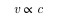

# 8. 진화적 아키텍처의 함정과 안티패턴
- 프로젝트 진화에 해악을 끼치는 커플링이 수없이 많음
- 그릇된 엔지니어링 관행은 함정과 안티패턴이라는 두 가지 형태로 구분
- 안티 패턴은 두가지 특성을 갖음
  - 처음에는 괜찮아 보이지만 나중에 가면 실수
  - 대부분 더 나은 대안이 존재 -> 뒤늦게 발견되기 때문에 아키텍트가 사전에 방지하기 어려움
- 함정은 표면적으로 괜찮은 아이디어처럼 보였다가 곧바로 나쁜 본색을 드러냄

## 8.1 기술 아키텍처
- 아래 내용들은 아키텍처의 진화와 개발팀의 역량을 해치는 일반적인 업계의 인습을 중점적으로 살펴봄

#### 8.1.1 안티패턴: 마지막 10%의 덫, 로우코드/노코드
- 로우 코드/노코드 활용 시, 모든 게 다 해결될거 같지만 결코 요구사항을 완벽하게 맞출 수 없음(마지막 10%의 덫)
- 이러한 방식을 수용 여부를 판단하는 과정에서 쉬운 사항(hello world)이 아닌 이러한 도구가 하지 못하는 일을 파악해야함
- 도구의 기본 기능을 테스트하기 보다는 도구의 한계를 먼저 시험하고, 이러한 한계의 대비책을 사전에 구축해두는 것이 좋음\
  (!) 솔루션 도입 시, 솔루션이 할 수 있는 방향 보단 하지 못하는 부분에 대해 생각하고 대비책을 간구해야함

#### 8.1.2 사례연구: PenultimateWidgets의 컴포넌트 재사용
- 커플링 지점이 진화를 방해하거나 중요한 아키텍처 특성을 저해할 경우 포크 또는 복제를 통해 커플링을 끊어야 함
- 아키텍처의 각종 특성을 평가하며 이들이 지속적으로 가치를 더하고 안티패턴으로 남겨지지 않도록 관리해야함
- 구축 당시 아키텍트가 내렸던 올바른 결정은 시간이 흐른 뒤 틀린 결정으로 뒤바뀌는 경우가 많음
  - 동적 평형 조건의 변화 때문임
- 원래의 결정은 틀리지 않았지만 생태계가 예상치 못한 방향으로 움직임

#### 8.1.3 안티패턴: 벤더 킹
- 벤더 킹 안티패턴: 특정 벤더를 중심으로 구축된 아키텍처를 의미하며, 조직과 도구가 병적인 수준의 결합을 이룬다는 특징
  - 도구를 활용하여 비즈니스 핵심 기능을 구현하지만, 자유롭게 가공은 힘듬
- 대부분의 회사가 도구를 고치지 않고 프로세스를 고치고나 프레임워크 권위에 굴복 -> 회사간 차별성이 없어짐
- 해당 안티패턴을 벗어나려면 모든 소프트웨어를 하나의 통합 지점으로 취급
  - 벤더 제품을 독립적인 통합 지점으로 취급해야함
  - 통합 지점 사이에 손상방지 계층을 구축하고 벤더 도구의 변경 사항이 아키텍처에 영향을 미치지 않도록 보호

#### 8.1.4 함정: 유출된 추상화

- 추상화라고 해서 완벽한건 아님 -> 스택의 복잡도가 증가하면 추상화 방해 문제
- 원시추상화: 낮은 수준의 추상화가 깨지며 예측할 수 없는 혼란을 일으키는 현상
  - 시스템이 너무 많은 계층으로 구축되어 있기에 결함은 스택을 따라 최상층까지 전파됨 -> 시스템 깊은 곳에서 사용자 인터페이스까지 전파
- 기술 스택의 복잡도 증가는 컴포넌트가 점점 복잡해짐에 따라 얽혀지는 결함에 취약해 짐
- 아키텍트는 이러한 문제를 피트니스 함수를 통해 보호되어야 함

#### 8.1.5 함정: 이력서 주도 개발
- 먼저 새로운 기술 보단 도메인을 면밀히 살피고 필요한 기능을 파악하는게 중요 -> 가장 적합한 기능을 갖추고 제약 사항이 적은 아키텍처 선정
- 이력서 주도 개발이란 함정에 빠지면 안됨 -> 이력서 경력을 추가하기 위해 가능한 한 모든 프레임워크와 라이브를 아키텍처에 동원
- 항상 문제 도메인을 이해해야 함

## 8.2 증분 변경
- 소프트웨어를 점진적으로 변경하기 어려운 이유는 많음
  - 애자일을 중요하게 여기기 시작한 것은 얼마되지 않음 -> 비용절감, 리소스 공유, 외부제약 조건 등의 목표 위주 제작 때문
- 현대적 엔지니어링 관행은 다양한 방식으로 진화적 아키텍처를 지원함

#### 8.2.1 안티패턴: 부적절한 거버넌스
- 과거 운영체제, 데이터베이스 서버, 애플리케이션 서버 등에 대한 활용은 적지 않은 비용이 들었음
- 이러한 환경에서의 아키텍트는 리소스 공유를 최대한 늘리는 방향으로 아키텍처를 설계함(예: DB를 공유해서 사용)
- 위와 같은 방식은 현재 더이상 의미가 희미해짐 -> 데브옵스, 컨테이너 기술 등을 통해 비용이 많이 감소됨
  - 현대 개발 환경은 단일 기술 스택의 균질성을 유지하는 거버넌스와는 맞지 않음
- 또한 단일 기술 스택의 균질성은 프로젝트 일관성과 인력 대체가 쉽다는 장점도 있지만, 과도한 엔지니어링에 시달리게하는 단점이 존재
  - 모놀리식 아키텍처는 거버넌스 결정이 모두에게 영향을 미침
- MSA는 이러한 기술적인 측면과 데이터 아키텍처 측면에서 서려 결합할 필요가 존재하지 않음
- 'just enough' 거버넌스는 대규모 저직에 적합한 거버넌스로 알려짐
  - '단순,적당,복잡' 각 세 정류의 형태에 맞춰 기술 스택을 선정
#### 8.2.2 사례연구: PenultimateWidgets의 'just Enough' 거버넌스
- 모든 개발 환경(자바와 오라클)을 표준화 하려고 노력 -> 소규모 서비스에 엄청난 복잡성 부여
- 아키텍트는 프로젝트가 서로 지식과 기술을 공유할 수 있도록 이식성을 유지하고 싶었음 -> MSA 전환 불가
- 'just enough' 거버넌스 선택하고 세종류의 기술 스택 선정
  - 소형: 루비 온 레이즐와 Mysql
  - 중형: GoLang과 카산드라,몽고 DB, Mysql
  - 대형: 자바와 오라클
#### 8.2.3 함정: 릴리스 속도 저하
- 지속적 전달의 엔지이너링 관행은 소프트웨어 릴리스 속도를 늦추는 원인을 개선하도록 설계됨
- 지속적 전달의 극대화 버전인 지속적 배포는 진화적 아키텍처의 필수 조건은 아님
  - 지속적 배포는 모든 변경 사항이 배포 파이프라인을 통과해야함
- 지속적 전달은 매트릭을 통해 프로젝트 최적화 방법을 학습하며 데이터에 기반한 결과를 도출하려 노력
  - 순환 주기는 리드타임을 기반으로 함 -> 추정 등의 주관적 활동이 포함되므로 적절하지 않음
    - 리드 타임: 새로운 발상이 탄생하고 소프트웨어에서 구체화되기까지의 기간
  - 순환 주기를 작업(소프트웨어 개발) 단위의 시작과 완료 사이의 경과 시간을 나타냄
    - 신기능 만들기 시작부터 해당 기능이 프로덕션 환경에서 실행될 때 기간
- 지속적 전달에 순환주기가 빠라다는 것은 아키텍처가 더 빠르게 진화할 수 있음을 의미함
  - 진화 속도와 순환 주기는 다음과 같은 비례 관계(u: 변화속도, c: 순환주기)로 나타냄\

- 시간이 지남에 따라 순환 주기는 점차 증가함 -> 요구사항에 맞는 피트니스 함수 증가 때문
  - 순환 주기가 3시간이었다가, 특정 시점 이후 4시간 초과할 경우 경보 울림
  - 해당 시간 이후 순환 주기를 4시간 이상으로 늘릴건지 결정해야함
- 설정한 순환 주기와 테스트 모음(피트니스 함수 포함) 중 어느쪽이 더 중요한지 결정해야함

## 8.3 비즈니스 관심사
- 비즈니스 담당자들은 아키텍처 관점에서 부적절한 결정을 내릴수 있는 우선권을 가지고 있기에, 의도치 않게 미래의 가능성을 제한함

#### 8.3.1 함정: 제품 맞춤화
- 영업 직원에게는 다양한 판매 조건이 필요함 -> 그들이 원하는 건 무한 맞춤 설할 수 있는 소프트웨어임
- 이러한 기능은 아래와 같은 다양한 구현 기술을 필요로 하며, 그에 따른 비용이 발생시킴
  - 고객별 고유 빌드: 특정 고객용 버전을 만들어 제공
  - 영구적인 기능 토글: 기능 토글을 통해 고객마다 다른 버전을 구축 및 제공
  - 제품 주도 맞춤화: 일부 제품의 다른 UI를 사용자에게 제공
- 위와 같은 제품의 요구사항이 추가될 수록 부담이 상당히 가증됨
  - 테스트 시나리오 뿐만 아니라 피트니스 함수도 증가함
- 각 상황마다 구축 비용을 평가하며 현실적인 관점으로 접근하는 것이 좋음
  - 맞춤 설정은 진화성을 저해하지만 현실적으로 지양해선 안됨

#### 8.3.2 안티패턴: 기록 시스템에 기반한 보고 시스템
- 대부분 애플리케이션은 비즈니스 기능에 따라 다양한 용도로 활용됨 -> 모든 비즈니스 기능을 하나의 애플리케이션으로 제공하기 어려움
  - 특히 애플리케이션이 모놀리식 아키텍처로 구축되고 하나의 DB 구조를 공유할 경우는 더욱 어려움
- 보고서는 모놀리식 아키텍처의 우발적 커플링을 설명하기 좋은 예시
  - 보고서 기능은 계층과 상관없이 데이터만 필요로 함
  - 데이터베이스 스키마와 직접 연결하여 데이터 추출 -> 데이터베이스 스키마가 변경되면 문제 발생
  - 위와 같은 상황은 아키텍트에게 진화적 변화의 난이도를 높이는 전형적인 사례
- 마이크로 서비스는 서비스가 아닌 동작을 분리하는 방식으로 보고서 문제를 해결함
  - 이벤트 스트리밍이나 메시지 대기열을 이용해 '기록 시스템'도메인을 구축

#### 8.3.3 함정: 과도하게 긴 계획 기간
- 예산을 책정하고 계획을 수립하는 프로세스는 적절한 가정과 이른 결정을 필요로 하는 경우가 많음
- 그러나 재검토 기화 없이 계획 기간만 길어진다면 가용 정보가 거의 없는 상태에서 점점 더 많은 결정을 내리거나 무리한 가정을 세워야함
- 가정을 너무 많은 노력을 기울이면 감정적 투자로 이어지며, 이는 많은 매몰 비용이 생김 -> 비합리적인 자료 첨부
  - 특정 대상에 시간과 많은 투자를 할수록 대상을 포기하기는 점점 어려워 짐
- 장기간 계획 주기는 아키텍트의 결정을 돌이키기 어렵게 함 -> 항상 선택의 여지를 남겨두어야함
  - 소프트웨어를 실제 구축하기 전에 대규모 투자가 결정되지 않도록 주의해야함