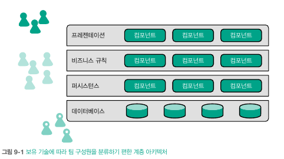
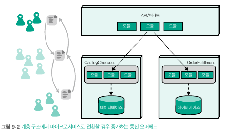
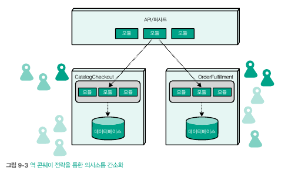
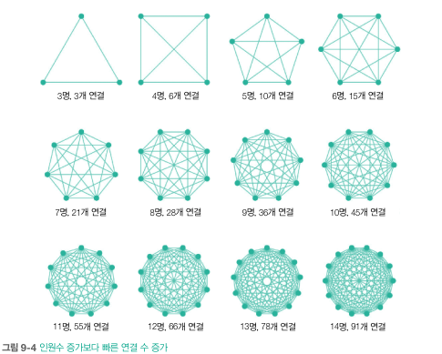
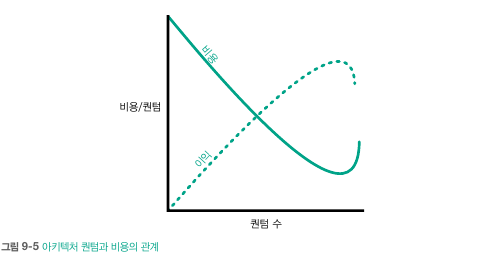
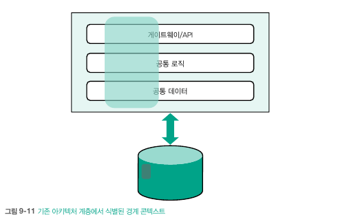
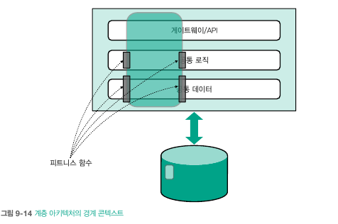

# 9. 아키텍처 실천
- 진화적 아키텍처를 실제로 구현하기 위해 필요한 사안들
  - 기술적인 측면뿐만 아니라 조직과 팀의 영향력과 같은 비즈니스 분야의 관심사도 포함

## 9.1 조직적 요인
- 소프트웨어 아키텍처는 소프트웨어와 관련이 없는 다양한 요소(팀 구조, 예산)에 놀라울 정도로 광범위한 영향력을 펼침

#### 9.1.1 콘웨이의 법칙

- 콘웨이 법칙사람들 사이의 의사소통 경로가 최종 제품 설계에 필연적으로 영향을 미친다는 개념
- 하나의 큰 문제를 작게 나누어 위임하면 각각을 조정하는 문제가 다시 발생
  - 계층 아키텍처는 인터페이스, 비즈니스 로직등을 기술적으로 계층을 나누지만 추후 공통 요건 처리에 오버헤드 발생
- 많은 조직이 보유에 따라 팀을 나눔
  - 프런트엔드, 백앤드, 데이터베이스 등
- 기술 계층과 아키텍처 계층이 유사하면 잘 작동됨\

- 분산 아키텍처로 전환하면 계층 간 메시지 증가하는 부작용 발생\

- 위임 영역이 불할되고 담당 범위가 좁아질 때마다 효과적인 설계 대안은 줄어듬
- MSA를 구축하는 회사는 기술적인 기준보다 서비스 경계를 기준으로 팀 구성\

###### 교차 가능팀
- 도메인 중심 팀은 교차기능 팀인 경우가 많음
  - 한 팀의 구성원만으로 제품의 모든 영역을 아우를 수 있음
  - 운영과 개발 사이에 존재하던 마찰을 제거
- 이러한 팀에는 다양한 역할 존재
  - 아키텍처
  - 비즈니스 분석가
  - 데이터
  - 개발자
  - 디자니어
  - 운영
  - 제품 관리자
  - 테스트
- 교차 기능팀의 목표 중 하나는 팀 조정 과정에서 발생하는 마찰을 근절
  - 모든 역할을 내재화 하므로 사일로를 조정하는 부수적인 마찰 제거

###### 비즈니스 기능 중심 팀 구성
- 도메인 중심으로 팀 구성 -> 비즈니스 기능 중심으로 팀 구성
- 많은 조직이 기술 아키텍처와 비즈니스 동작이 느슨한 관계를 유지하기를 바람
  - 전통적으로 아키텍트가 순수하게 기능 위주로 아키텍처를 분활
  - 비용 절감 추구하며 공유 리소스에 중점을 두었기 때문
- 아키텍트는 조직 내부 곳곳에 오픈 소스를 도입하며 점차 상용 도구의 제한에서 벗어남
  - 개발자가 원하는 기능을 갖춘 환경을 자유롭게 생성하면, 아키텍처도 기술 -> 도메인을 향해 이동
###### 비즈니스 기능과 인지 부하의 균형
- 지속적 가치 흐름에 최적화된 팀 설계 기법에서 4가지 팀 패턴 제시
  - 스트림 정렬팀: 비즈니스 도메인의 작업 흐름과 일치하는 팀
  - 활성화 팀: 스트림 정렬팀의 장애물 극복과 부족한 기술을 습득하도록 지원
  - 난해한 하위시스템 팀: 비즈니스 도메인 중 수학/계산/기술 분야를 담당
  - 플랫폼 팀: 스트림 정렬팀의 업무속도를 가속하기 위해 내부 도구를 생산하는 팀
- 팀을 설계할 때 인지 부하를 반드시 함께 고려해야함
  - 복잡한 도메인 영역을 담당하거나 복잡한 기술 집합을 다루는 팀은 인지부하 발생 -> 업무 지장
- 인지 부하에 대처하는 방법 
  - 스트림 정렬팀 복수 구성
  - 나해한 하위팀을 보조로 두는 것

###### 프로젝트를 넘어 제품으로
- 개발팀은 소프트웨어를 프로젝트라는 시점을 통해 개발하기에, 운영팀에서 요구사항에 대한 운영 대처가 힘듬
  - 원래 개발팀은 다른 업무 수행으로 인한 버그 대처 힘듬
  - 코드 품질 등한시 문제
- 소프트웨어를 프로젝트가 아닌 제품으로 여기기 시작하면 회사의 관점이 전환
  - 수명 주기가 있는 프로젝트와 달리 제품은 영원히 살아남음
  - 각 제품의 소유자를 지정 가능
  - 교차기능팀이 제품을 담당하므로 역활이 뚜렷함
- 개발자는 품질 지표에 주인 의식을 느끼며 제품의 결함에 더욱 많은 관심을 기울이게 됨

###### 과도한 팀 규모 지양
- 대형 개발팀이 성과를 내지 못하는 사례 다수 존재
- 문제는 사람의 수가 아니라 사람들이 만들어 내는 연결의 수\

- 인원이 늘어갈 수록 연결의 수도 기하급수적으로 늘어남\

  - 폭증하는 의사소통을 제한하려면 팀인원 축소와 교차기능팀으로 구성

###### 팀 커플링 특성
- 기업이 조직을 구축하고 관리하는 방식은 소프트웨어를 구축하고 설계하는 방식에 상당한 영향을 미침

#### 9.1.2 문화
- 아키텍트가 도구를 선택하고 설계를 추진하는 의사결정 과정은 진화를 감당하는 능력에 지대한 영향을 미침
  - 탁월한 아키텍트는 리더십을 발휘하며 기술 문화를 조성하고 개발자를 위해 시스템 구축 방식을 설계
  - 진화적 아키텍처 구축에 필요한 기술을 엔지니어에게 전수하고 장려
- 만약 팀이 변화에 익숙하지 않다면? 팀의 변화를 우선시하도록 유도하는 장치 마련
- 코드리뷰는 현재의 코드가 얼마나 변화에 잘 적응할지 자연스럽게 고민할 수 있는 지점
- 진화적 아키텍처를 추구하는 아키텍트는 진화성을 높이는 설계를 우선시하는 팀에 주목, 이러한 관행을 다른팀에 장려할 방법 강구
#### 9.1.3 실험 문화
- 진화가 성공하려면 실험이 뒷받침되어야함
  - 실험이란 소소하지만 새로운 아이디어를 정기적으로 시도하는 활동
  - 설동적인 실험이란 이러한 시도가 무사히 기존 시스템에 통합됐음을 의미
- 조직은 다양한 방법으로 실험을 장려 가능
  - 외부 아이디어 도입: 외부 컨퍼런스를 통해 새로운 기술 등 습득
  - 명시적 개선 장려: 모든 인원은 지속적으로 개선을 추구
  - 스파이크 구현 및 안정화: 난해한 기술 문제 학습을 목표로 일회성 솔루션을 제작해보기
  - 혁신 시간 확보: 인력들에게 혁신 시간 할당
  - 집합 기반 개발: 같이 여러 조건을 탐색하면서 개발
  - 엔지니어와 최종 사용자 연결: 개발팀과 제품 담당자가 실험을 통해 고객 반응 직접 확인

#### 9.1.4 CFO와 예산
- 예산 책정은 전통적으로 엔터프라이즈 아키텍처의 일부였음 -> 예산 책정을 위해 생태계의 장기 추세를 예측하는 능력 필요
- 동적 환경에서의 예측은 필요 없음
- 아래와 같이 아키텍처 퀀텀과 아키텍처 비용 사이에는 상관관계 존재\

  - 아키텍처를 구성하는 요소가 작아지므로 관심사가 더욱 명확하게 분리 및 정의
  - 물리적인 퀀텀수가 늘어나면 운영을 자동화로 대응해야함
  - 퀀텀이 지나치게 작아지면 규모 자체가 비용을 유발함
- 아키텍트는 진화적 아키텍처를 설계하며 퀀텀 크기와 비용을 사이에 적정 지점을 찾아야함

## 9.2 비즈니스 사례
- 다양한 기술과 세부 사항도 중요하지만 지식이 실질적인 비즈니스 가치를 실현 못하면 쓸모 없음

#### 9.2.1 가설 주도 개발 및 데이터 주도 개발
- 데이터 주도 개발: 데이터를 중심으로 기술적 변화를 도모하는 개발 방법론
- 가설 주도 개발: 기술 측면의 관심사 대신 비즈니스를 통합
  - 요구사항이 아닌 가설에 근거해 새로운 기능 추가(과학적 방법론에 시간과 자원 투자)
  - 요구사항에 대한 가설을 세우고 A/B 테스트로 수치 비교해서 입증
- 가설 주도 개발을 도입하려면 진화적 아키텍처, 현대적 데브옵스 등의 다양한 요소를 조율해야함
  - 가설에 대한 결과물을 자유롭게 만들고 배정할 수 있어야 함 -> 유의미한 결과를 얻을 때까지 충분히 수행

#### 9.2.2 실험적 매체로서의 피트니스 함수
- 아키텍트는 가설 주도 개발에 응답하는 용도로 피트니스 함수를 활용
  - 아키텍트가 내리는 수많은 결정이 이전에 존재하지 않은 경우가 많음
  - 피트니스 함수로 가설 검증 가능

## 9.3 엔터프라이즈 피트니스 함수 구축
- 진화적 아키텍처에서 엔터프라이즈 아키텍트의 역할은 '엔터프라이느 피트니스 함수'와 '지침'을 중심으로 이루어짐
  - MSA는 이러한 변화가 반영된 결과물
  - 리소스 공유가 없는 대신 커플링 지점에 대한 지침을 제공해야함

#### 9.3.1 사례연구: 제로데이 보안 취약점
- 사용중인 개발도구 및 라이브러리에 제로데이 취약점이 발견되면? 스캐닝 도구는 많지만 정확한 시점에 취약점 테스트하는 도구는 많지 않음
- 거버넌스가 자동화된 세계는 모든 프로젝트를 파이프라인으로 배포
  - 파이프라인을 보안 피트니스 함수를 적용 가능
  - 배포 파이프라인은 생태계의 모든 변화를 파악하는 장소 -> 공통 관심사를 검증 가능

#### 9.3.2 기존 통합 아키텍처의 경계 콘텍스트

- 계층 아키텍처는 관심사의 분리를 촉진하고 재사용의 편의성을 높임
- 계층을 가로지르는 관심사에 대처하기 어려움 -> 횡단 관심에 대해 대처가 어려움

- 각 분할 지점에 피트니스 함수를 구축하여 우발적인 커플링을 방지 가능
## 9.4 시작 시점
- 낡은 아키텍처는 진화성을 도입할 시작 지점을 찾기 어려움
- 진화성 구축의 첫 단계는  적정 커플링과 모듈 사용성을 파악하는 거지만, 가끔 다른 우선순위를 따라야할 수 있음
  - 데이터 스키마가 손대기 힘들 정도로 결합도가 높으면 DBA가 먼저 모듈성 검토해야함
#### 9.4.1 낮게 매달린 과일
- 아키텍트는 아키텍처에서 가장 다루기 쉬운 요소를 선택해야함
- 메트릭은 증분 변경 환경에서 배포 파이프라인이 남기는 부속물
  - 구체적인 데이터는 개발자의 방법론을 심하하는 좋은 근거 자료
- '가장 쉬운 것부터' 원칙은 가치를 비용을 대가로 리스크를 최소화
#### 9.4.2 최대 가치 우선
- '가장 쉬운 것부터'의 상대편에는 '최대 가치 우선' 원칙 존재
- 시스템의 가장 중요한 부분을 확인하고 이를 중심으로 진화적 행동을 구축하는 방식
  - 아키텍트가 진화적 아키텍처에 확신이 있을 때
  - 진화적 아키텍처가 가져올 장기적 가치를 가늠해 보고 싶을 때
  - 기존 어플리케이션에 진화적 아키텍처가 적용이 가능할지 확신이 없을 때

#### 9.4.3 테스트
- 코드 베이스에 테스트가 없다면 진화적 아키텍처 적용보단 테스트가 우선임
  - 테스트는 진화적 아키텍처의 증분 변경에 관련된 중요한 컴포넌트

#### 9.4.4 인프라스트럭처
- 신기능 도입이 더딘 곳에서 혁신의 부재로 피해보는 곳은 운영 그룹
- 인프라 결함이 있으면 진화적 아키턱체를 구축하기 전에 해당 문제 해결 필요
  - 데브옵스가 필요한데 그러한 환경이 되지 못하면 진화적 아키텍처 무용지물
- 또 다른 인프라 기능 장애는 개발과 운영 사이의 극복 불가능한 장벽\
  (?)사일로 현상을 말하는 듯
- 아키텍트와 개발자가 모범 사례를 등한시 하면 엄청난 기술 부채가 인프라에 축적됨

#### 9.4.5 사례연구: PenultimateWidgets의 엔터프라이즈 아키텍처
- 여러한 이슈들에 대해 피트니스 함수로 기준을 정의하고 신규 파이프라인 구축
  - 아키텍트가 핵심 기능의 피트니스 함수는 파이프라인 구축, 서비스용 피트니스 함수는 개발팀에 전담

## 9.5 미래 전망
- 피트니스 함수의 난이도는 점점 높아지고 있지만 시간이 지남에 따라 피트니스 함수를 지원하는 도구들이 많아질 것임
  - 애자일을 중요하게 여길 무렵, 자동화 문제를 극복했던 것과 같은 현상
#### 9.5.1 AI를 활용한 피트니스 함수
- AI 도구를 활용하여 비정상적인 동작을 감지하는 AI 기반 피트니스 함수가 현실화

#### 9.5.2 생성 테스트
- 개발자가 대량의 테스트를 실행하고 결과를 수집한 다음 통계와 분석을 이용하여 이상한 행동을 발견

## 9.6 되는 이유와 안되는 이유
- 아키텍처의 만병통치약은 존재하지 않음
- 명확하게 이득이 되지 않는 한, 진화성을 도입하기 위해 비용과 여력을 낭비할 필요 없음

#### 9.6.1 기업이 진화적 아키텍처를 구축하는 이유
- 진화적 아키텍처가 합리적인 선택인 이유
###### 예측성 vs 진화성
- 기업은 예측성의 높은 가치를 두지만 소프트웨어 생태계에서는 퇴색됨
  - 계획은 수립할 수 있지만, 언제든지 무효화될 수 있음
- 진화적 아키텍처를 구축하려면 시간과 노력이 들지만 실제 변화에 대응 가능

###### 확장성
- 데이터 베이스 중심의 모놀리식 아키텍처 -> 트래픽 증가할 때마다 데이터베이스 확장 및 한계 도달함
  - MSA 스타일에 가깝게 재설계하고 나서야, 비로소 아마존의 전체 생태계 확장 가능
- 진화성은 디커플링에 뒤따르는 부수적 이득

###### 고급 비즈니스 기능
- 증분 변경 기술이 장착되면 가설 주도 개발 및 데이터 주도 개발처럼 이름난 관행 도입 가능

###### 비즈니스 지표로서의 순환 주기
- 시장은 이미 순환 주기(CD)를 비즈니스의 차별화 요소로 인정함
  - 보수적인 일부 대기업은 소프트웨어를 오버헤드로 간주하고 비용 절감 대상으로 취급
  - 혁신적인 기업은 소프트웨어는 갱정 우위를 점하는 수단

###### 퀀텀 수준의 아키텍처 특성 격리
- 비기능적 요구사항은 피트니스 함수로 전환하고 아키텍처 퀀텀을 구축하면, 퀀텀마다 서로 다른 특성 부여 가능
  - 하나의 퀀텀이 보유한 기술 아키텍처는 다른 퀀텀으로부터 격리됨

###### 적응 vs 진화 
- 적응의 부작용은 기술 부채 증가
  - 많은 조직이 점진적으로 증가하는 기술 부채와 재구조화 지연이라는 함정에 빠짐
  - 개발자에게 적응이란 원래 동작을 보존하고 새로운 동작을 나란하게 추가하는 것
  - 컴포넌트 순환 주기를 겪는 횟수가 늘어날수록 병렬 동작과 복잡도 증가
- 진화는 근본적인 변화를 의미
  - 진화적 아키텍처 구축은 아키텍처의 변화를 의미 -> 피트니스 함수를 통해 비요구사항 보호

#### 9.6.2 기업이 진화적 아키텍처를 구축하지 않는 이유
- 진화적 아키텍처가 만병통치약은 아님

###### 커다란 진흙 공
- 아키텍트가 아키텍처의 타당성을 간과하는 경향 있음 -> 진화보다 새로 만드는게 더 쉬울수도 있음
  - 진화적 아키텍처가 반드시 필요한가에 대한 답변
- 새로 개편과 진화 선택 기준은 모듈성 파악
  - 시스템에 존재하는 모든 모듈성을 확인하고 이를 중심으로 아키텍처를 재구성

###### 지배적인 아키텍처의 특성
- 진화성은 아키텍처 스타일을 선택하기 위해 평가하는 여러 특성 중 하나
  - 사로 상충되는 핵심 목표를 동시에 완벽하게 지원할 수 있는 아키텍처는 존재하지 않음
- 대부분의 아키텍트는 가급적 넓은 범위에서 요구 사항에 부합하는 아키텍처를 선정

###### 희생적 아키텍처
- 희생적 아키텍처: 버려지도록 설계된 아키텍처
- 프로토타입으로 만들어진 시스템은 미고려

###### 폐업 예정 비즈니스
- 진화적 아키텍처는 변화하는 생태계의 압력으로 부터 기업의 적응을 도움
- 빠른 시일내 폐기될꺼면 진화성을 구축할 이유가 없음
